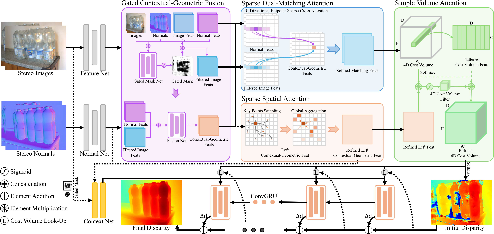
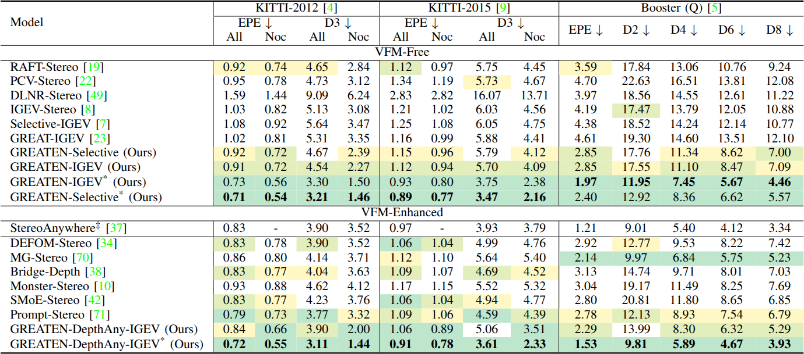
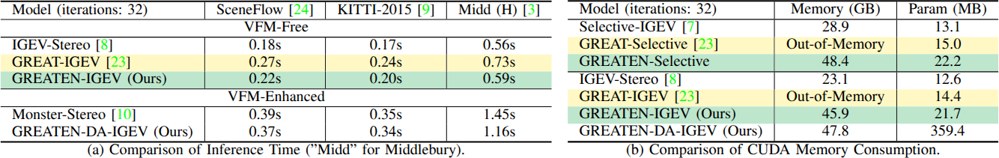

# :rocket: GREATEN-Stereo :rocket:
This repository contains the source code for our paper.

**Geometry Reinforced Efficient Attention Tuning Equipped with Normals for Robust Stereo Matching (GREATEN-Stereo)**
<a href="https://arxiv.org/pdf/2604.09142">
  
</a>

Jiahao LI, Xinhong Chen, Zhengmin JIANG, Cheng Huang, Yung-Hui Li, Jianping Wang

<p align="center"></p>
<div align="center">
  </img>
</div>
<p></p>

## :bulb: Abstract
Despite remarkable advances in image-driven stereo matching over the past decade, Synthetic-to-Realistic Zero-Shot (Syn-to-Real) generalization remains an open challenge. This suboptimal generalization performance mainly stems from cross-domain shifts and ill-posed ambiguities inherent in image textures, particularly in occluded, textureless, repetitive, and non-Lambertian (specular/transparent) regions. To improve Syn-to-Real generalization, we propose GREATEN, a framework that incorporates surface normals as domain-invariant, object-intrinsic, and discriminative geometric cues to compensate for the limitations of image textures. The proposed framework consists of three key components. First, a Gated Contextual-Geometric Fusion (GCGF) module adaptively suppresses unreliable contextual cues in image features and fuses the filtered image features with normal-driven geometric features to construct domain-invariant and discriminative contextual-geometric representations. Second, a Specular-Transparent Augmentation (STA) strategy improves the robustness of GCGF against misleading visual cues in non-Lambertian regions. Third, sparse attention designs preserve the fine-grained global feature extraction capability of GREAT-Stereo for handling occlusion and texture-related ambiguities while substantially reducing computational overhead, including Sparse Spatial (SSA), Sparse Dual-Matching (SDMA), and Simple Volume (SVA) attentions. Trained exclusively on synthetic data such as SceneFlow, GREATEN-IGEV achieves outstanding Syn-to-Real performance. Specifically, it reduces errors by 30% on ETH3D, 8.5% on the non-Lambertian Booster, and 14.1% on KITTI-2015, compared to FoundationStereo, Monster-Stereo, and DEFOM-Stereo, respectively. In addition, GREATEN-IGEV runs 19.2% faster than GREAT-IGEV and supports high-resolution (3K) inference on Middlebury with disparity ranges up to 768.

**Our main contributions are:**
- We introduce the Gated Contextual-Geometric Fusion (GCGF) module that effectively fuses stereo-image and surface-normal features to mitigate cross-domain discrepancies and the ill-posed ambiguities inherent in image textures, thereby enhancing Synthetic-to-Realistic (Syn-to-Real) generalization.
- We design the Specular-Transparent Augmentation (STA) strategy to intentionally disturb the texture consistency of training images, forcing the GCGF module to better filter ambiguous image textures and improve fusion reliability.
- We develop sparse attention alternatives to preserve the global feature extraction capability of [GREAT-Stereo](https://github.com/JarvisLee0423/GREAT-Stereo) for handling ambiguities in occluded and texture-related ill-posed regions, while significantly reducing computational cost, termed as Sparse Spatial Attention (SSA), Sparse Dual-Matching Attention (SDMA), and Simple Volume Attention (SVA).
- Trained solely on synthetic data, our GREATEN-Stereo outperforms existing published stereo-matching methods in Synthetic-to-Realistic generalization across five major real-world benchmarks: [ETH3D](https://www.eth3d.net/datasets), [Middlebury](https://vision.middlebury.edu/stereo/submit3/), [KITTI-2012](https://www.cvlibs.net/datasets/kitti/eval_scene_flow.php?benchmark=stereo), [KITTI-2015](https://www.cvlibs.net/datasets/kitti/eval_scene_flow.php?benchmark=stereo), and [Booster](https://cvlab-unibo.github.io/booster-web/).

## :clapper: Demos & Results
<p align="center"></p>
<div align="center">
  </img>
</div>
<p></p>

Demo visualization of our captured stereo pairs. "DA" denotes "DepthAny". All the models are trained exclusively on synthetic datasets.

<p align="center"></p>
<div align="center">
  </img>
</div>
<p></p>

<p align="center"></p>
<div align="center">
  </img>
</div>
<p></p>

Synthetic-to-Realistic Zero-Shot visualization of GREATEN-Stereo on the Booster, Middlebury, and ETH3D. "DA" denotes "DepthAny". All the models are trained exclusively on synthetic datasets.

<p align="center"></p>
<div align="center">
  </img>
</div>
<p></p>

Synthetic-to-Realistic Zero-Shot performance of GREATEN-Stereo on the KITTI-2012, KITTI-2015, and Booster. Unless specified, all models are trained from scratch on SceneFlow. StereoAnywhere is trained from a frozen RAFT-Stereo checkpoint with extra supervisions for surface normals, and uses priors of VFM pretrained on the [HyperSim](https://github.com/apple/ml-hypersim) dataset. * denotes training on our Syn-to-Real Mixed datasets.

<p align="center"></p>
<div align="center">
  </img>
</div>
<p></p>

Comparison of the computational overhead of GREATEN-Stereo on the SceneFlow, KITTI-2015, and Middlebury. "DA" denotes "DepthAny". Results in Table (a) are evaluated on NVIDIA RTX 4090. Results in Table (b) are inferred on NVIDIA A800-80GB using Full-Resolution Middlebury and max disparity set to 768.

## :gear: Environment Settings

* NVIDIA RTX 4090
* python 3.8

```Shell
conda create -n greaten python=3.8
conda activate greaten

pip install torch torchvision torchaudio xformers==0.0.22.post3+cu118 --index-url https://download.pytorch.org/whl/cu118
pip install tqdm==4.67.1
pip install scipy==1.10.1
pip install opencv-python==4.11.0.86
pip install scikit-image==0.21.0
pip install tensorboard==2.12.0
pip install matplotlib==3.7.5
pip install timm==0.5.4
pip install numpy==1.24.1
pip install einops==0.8.1
pip install open3d==0.19.0
pip install kornia==0.7.3
pip install setuptools==69.5.1

cd utils/stereo_matching/cuda_utils/deformable_aggregation && pip install -e .
```

## :floppy_disk: Required Data

* [SceneFlow](https://lmb.informatik.uni-freiburg.de/resources/datasets/SceneFlowDatasets.en.html)
* [KITTI](https://www.cvlibs.net/datasets/kitti/eval_scene_flow.php?benchmark=stereo)
* [ETH3D](https://www.eth3d.net/datasets)
* [Middlebury](https://vision.middlebury.edu/stereo/submit3/)
* [Booster](https://cvlab-unibo.github.io/booster-web/)
* [TartanAir](https://github.com/castacks/tartanair_tools)
* [VKITTI2](https://europe.naverlabs.com/research/proxy-virtual-worlds/)
* [CREStereo Dataset](https://github.com/megvii-research/CREStereo)
* [FallingThings](https://research.nvidia.com/publication/2018-06_falling-things-synthetic-dataset-3d-object-detection-and-pose-estimation)
* [InStereo2K](https://github.com/YuhuaXu/StereoDataset)
* [Sintel Stereo](http://sintel.is.tue.mpg.de/stereo)
* [HR-VS](https://drive.google.com/file/d/1SgEIrH_IQTKJOToUwR1rx4-237sThUqX/view)

## :test_tube: Evaluation

1. Download the Checkpoints:

| Model | Link |
| :-: | :-: |
| DepthAnything V2 | [Download :laughing:](https://github.com/DepthAnything/Depth-Anything-V2) |
| GREATEN-IGEV-SceneFlow-192 | [Download :laughing:](https://pan.baidu.com/s/1Gfbwayf6-ime-AkrZUhfzA?pwd=behc) |
| GREATEN-Selective-SceneFlow-192 | [Download :laughing:](https://pan.baidu.com/s/1HqdpcvNM7-h5gy8LOl7Q8g?pwd=jhvr) |
| GREATEN-DepthAny-IGEV-SceneFlow-192 | [Download :laughing:](https://pan.baidu.com/s/1CAZuu3OmheNLeiLNp9E9mA?pwd=362k) |
| GREATEN-IGEV-Mixed-192 | [Download :laughing:](https://pan.baidu.com/s/1mi6czlCQTvFwuQ4am3S3Gw?pwd=ueby) |
| GREATEN-Selective-Mixed-192 | [Download :laughing:](https://pan.baidu.com/s/1jXP_y2Z00ZOH-yj74WIbpg?pwd=bq8s) |
| GREATEN-DepthAny-IGEV-Mixed-192 | [Download :laughing:](https://pan.baidu.com/s/1Q74sCq6t013-59nHv0YzFw?pwd=qmtu) |
| GREATEN-IGEV-RVC-192 | [Download :laughing:](https://pan.baidu.com/s/1yFA3aX5tRhy75f1JqfXQhw?pwd=3vdq) |
| GREATEN-DepthAny-IGEV-RVC-192 | [Download :laughing:](https://pan.baidu.com/s/1q4hwMbfGpA-SvJabCPCdAg?pwd=qyjh) |

2. Change the following parameters in the script located at `launchers/stereo_matching/test_launcher/`.
    - `dataset`
      - Choices => [sceneflow, kitti, booster, eth3d, middlebury_(Q | H | F)]
    - `dataset_root`
      - your/path/to/corresponding/dataset
    - `restore_ckpt`
      - your/path/to/checkpoint
    - `max_disp` (Optional)
      - `768` for Middlebury and `192` for others

3. Run the evaluation (e.g. Evaluation of GREATEN-IGEV on Scene Flow test set).
```Shell
./launchers/stereo_matching/test_launcher/greaten_igev_evaluator.sh
```

4. (Optional) You can also change the `eval_mode` in the evaluation script to get different evaluation results.
    - `metric` to generate evaluation quantity results (Default).
    - `pcgen` to generate the points cloud of predicted disparity for visualization.
    - `cvvis` to generate the visualization of the cost volume.

## :books: Training

1. Change the following parameters in the script located at `launchers/stereo_matching/train_launcher/`.
    - `logdir`
      - your/path/to/save/training/information
    - `train_datasets`
      - Choices => [sceneflow, vkitti2, kitti, syn_to_real_train, rvc_mix_data_train, eth3d_train, eth3d_finetune, middlebury_train, middlebury_finetune]
    - `train_datasets_root`
      - your/path/to/corresponding/dataset
    - `restore_ckpt` (Optional)
      - your/path/to/checkpoint/for/finetuning

2. Run the training (e.g. Training of GREATEN-IGEV on Scene Flow test set).
```Shell
./launchers/stereo_matching/train_launcher/greaten_igev_trainer.sh
```

## :package: Submission

For submission to the KITTI benchmark (e.g. GREATEN-IGEV).
```Shell
python3 save_disp_kitti.py --name greaten-igev-stereo --restore_ckpt your/path/to/checkpoint --left_imgs your/path/to/left/imgs --right_imgs your/path/to/right/imgs --output_directory your/path/to/save/submission/results
```

For submission to the ETH3D benchmark (e.g. GREATEN-IGEV).
```Shell
python3 save_disp_eth3d.py --name greaten-igev-stereo --restore_ckpt your/path/to/checkpoint --left_imgs your/path/to/left/imgs --right_imgs your/path/to/right/imgs --output_directory your/path/to/save/submission/results
```

For submission to the Middlebury benchmark (e.g. GREATEN-IGEV).
```Shell
python3 save_disp_middlebury.py --name greaten-igev-stereo --restore_ckpt your/path/to/checkpoint --left_imgs your/path/to/left/imgs --right_imgs your/path/to/right/imgs --output_directory your/path/to/save/submission/results
```

## :open_book: Citation
If you find our works useful in your research, please consider citing our papers.

```bibtex
GREAT-Stereo:
@inproceedings{li2025global,
  title={Global regulation and excitation via attention tuning for stereo matching},
  author={Li, Jiahao and Chen, Xinhong and Jiang, Zhengmin and Zhou, Qian and Li, Yung-Hui and Wang, Jianping},
  booktitle={Proceedings of the IEEE/CVF International Conference on Computer Vision},
  pages={25539--25549},
  year={2025}
}

GREATEN-Stereo:
@misc{li2026geometryreinforcedefficientattention,
  title={Geometry Reinforced Efficient Attention Tuning Equipped with Normals for Robust Stereo Matching}, 
  author={Jiahao Li and Xinhong Chen and Zhengmin Jiang and Cheng Huang and Yung-Hui Li and Jianping Wang},
  year={2026},
  eprint={2604.09142},
  archivePrefix={arXiv},
  primaryClass={cs.CV},
  url={https://arxiv.org/abs/2604.09142}, 
}
```

## Acknowledgements
This project is based on [IGEV-Stereo](https://github.com/gangweix/IGEV), [Selective-Stereo](https://github.com/Windsrain/Selective-Stereo), and [Monster](https://github.com/Junda24/MonSter). Meanwhile, the core attention modules of this project are modified from [GREAT-Stereo](https://github.com/JarvisLee0423/GREAT-Stereo) based on Deformable Attention implementations from [GaussianFormer](https://github.com/huang-yh/GaussianFormer). We thank the original authors for their excellent work.
